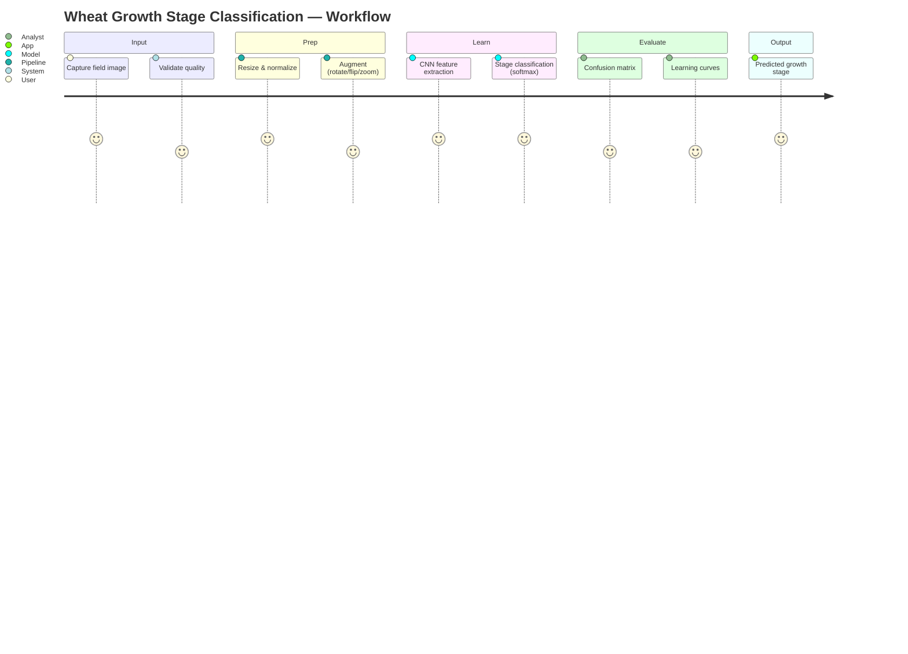
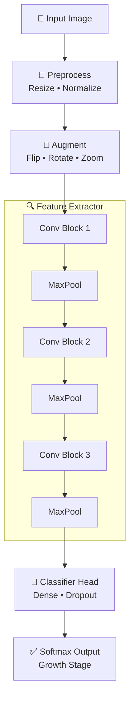

<!-- ===================================================== -->
<!--   Wheat Growth Stage Classification — README.md       -->
<!--   Classy • Visual • Interactive • Recruiter-Ready     -->
<!-- ===================================================== -->

<!-- ✅ SAME BRAND BANNER STYLE (consistent across projects) -->

 

  

<a href="#-project-overview"><b>Overview</b></a> •
<a href="#-visual-workflow"><b>Workflow</b></a> •
<a href="#-model-architecture"><b>Model</b></a> •
<a href="#-results--evaluation"><b>Results</b></a> •
<a href="#-contact"><b>Contact</b></a>

---

## 🌾 Project Overview

This project implements a **deep learning image classification system** for identifying **wheat growth stages** using CNN-based vision modeling.

It demonstrates:
- 🌱 Computer vision applied to agriculture  
- 🧠 Model training + evaluation pipeline  
- 📊 Visual diagnostics (learning curves, confusion matrix)  
- 📦 End-to-end workflow thinking (preprocess → train → evaluate)  

---

## 🧩 Visual Workflow

<b>🗺️ Pipeline Map (click to collapse)</b>

 

<!-- ✅ Different visuals: Mermaid "journey" (looks very different from flowcharts) -->

---

## 🧠 Model Architecture (Different Visual Style)

<b>🏗️ CNN Blueprint (click to collapse)</b>

 

<!-- ✅ Different visuals: Mermaid "graph TB" but as a layered blueprint with grouped subgraphs -->

---

## 📊 Results & Evaluation (Classy Infographic Look)

<table>
<tr>
<td width="33%" align="center" valign="top">

### 🎯 Task
Multi-class growth stage prediction

</td>
<td width="33%" align="center" valign="top">

### 🌱 Domain
Precision agriculture / crop monitoring

</td>
<td width="33%" align="center" valign="top">

### 🧠 Approach
CNN + augmentation + evaluation

</td>
</tr>
</table>

<b>📌 What’s evaluated? (click to expand)</b>

 

- Learning curves (train/val loss + accuracy)  
- Confusion matrix (per-stage confusion)  
- Generalization stability (augmentation impact)  
- Error patterns (stage-to-stage misclassification)  

---

## 🌍 Real-World Application

This can plug into:
- 📱 Mobile crop monitoring apps  
- 🛰 Drone-based field inspection  
- 🚜 Precision farming decision systems  
- 📈 Growth-stage tracking for yield optimization  

---

## 🤝 Contact

  
Wheat Growth Stage Classification — practical computer vision for precision agriculture.

